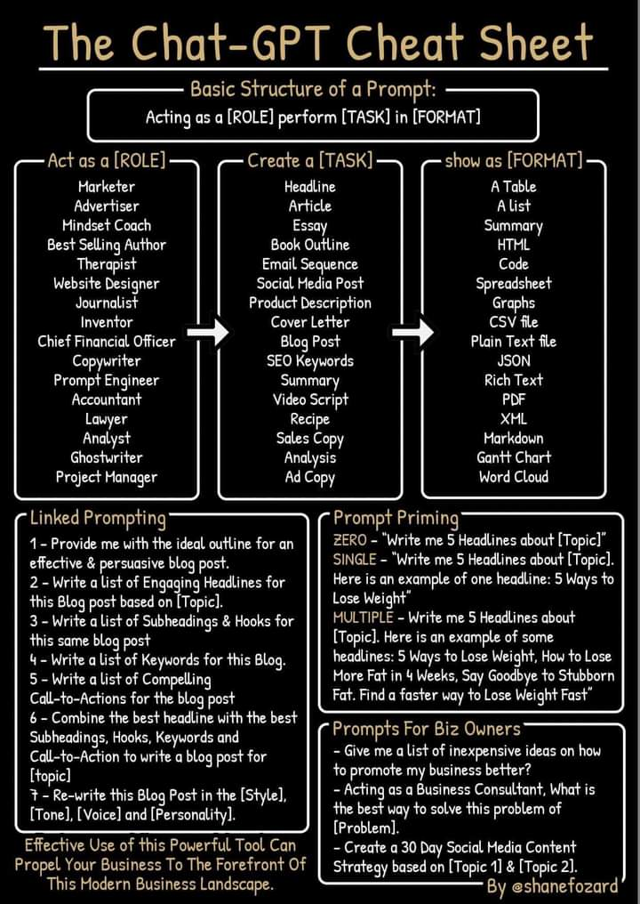
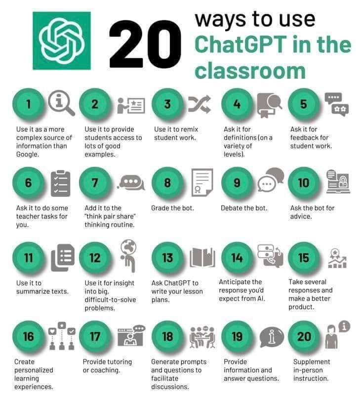
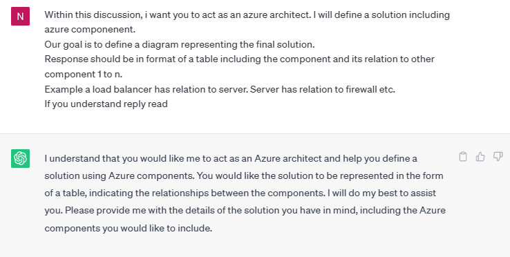
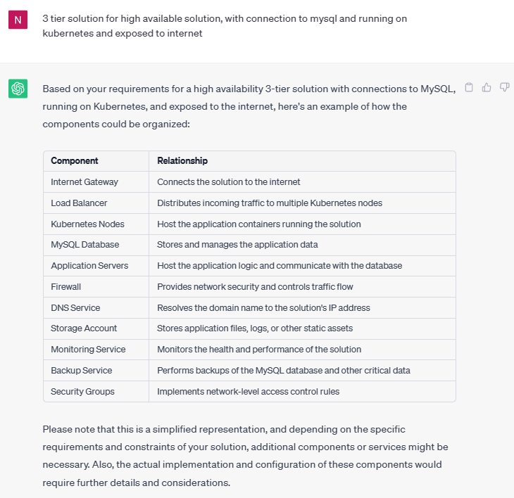
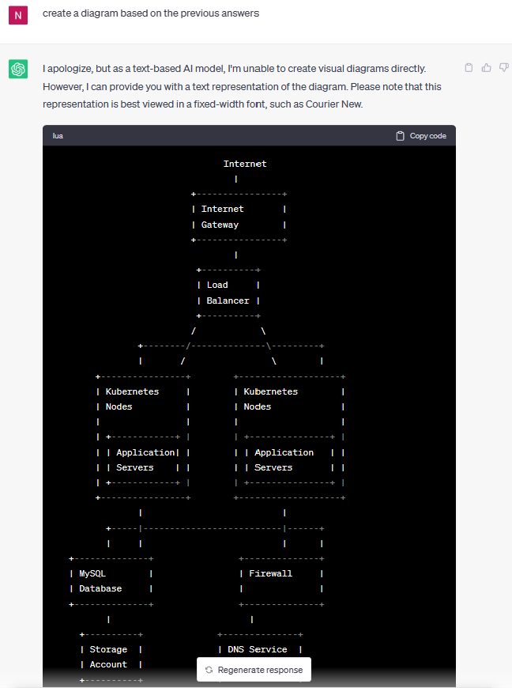

# ChatGPT Prompt Optimization Training

Welcome to the ChatGPT Prompt Optimization Training! This session is designed to help you maximize your interactions with ChatGPT by explaining how to create effective prompts. By following the provided techniques and strategies, you will learn how to elicit more accurate and relevant responses from the model, enhancing your overall conversational experience.

## Table of Contents

- Introduction
- Understanding ChatGPT
- Effective Prompt Creation
- ChatGPT Prompt Cheatsheet
- 20 ways to use ChatGPT in classroom
- Examples: Creating Azure Diagrams with ChatGPT

## Introduction
ChatGPT is a powerful language model that can engage in meaningful conversations. However, to make the most out of your interactions, it's essential to provide clear and well-structured prompts. This training session will guide you through the process of optimizing your prompts to improve the quality of responses from ChatGPT.

## Understanding ChatGPT
Before diving into prompt optimization, it's important to understand how ChatGPT works. ChatGPT is based on GPT-3.5, a state-of-the-art language model developed by OpenAI. It has been trained on a vast amount of diverse text data and is capable of generating coherent and contextually relevant responses based on the input it receives.

## Effective Prompt Creation
To create effective prompts for ChatGPT, consider the following strategies:

### Be clear and specific:
Clearly communicate your requirements to ChatGPT in your prompt. Specify the desired format or type of response you are looking for.

### Provide context: 
Context is crucial for ChatGPT to generate accurate responses. Provide relevant information about the topic or situation you want to discuss.

### Use system and user messages: 
To create interactive conversations, structure your prompts as a back-and-forth dialogue between the user and the model. Alternate between system (model) and user messages.

### Experiment and iterate: 
If you're not satisfied with the initial responses, experiment with different prompts. Iterate and refine your prompts to obtain the desired output.

### ChatGPT Prompt Cheatsheet

### 20 ways to use ChatGPT

### Examples: Creating Diagrams with ChatGPT
ChatGPT can be a helpful tool for creating diagrams and visual representations. Here's an example of creating a diagram:

#### Prompt :

